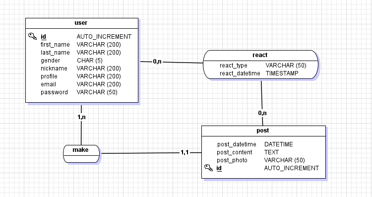
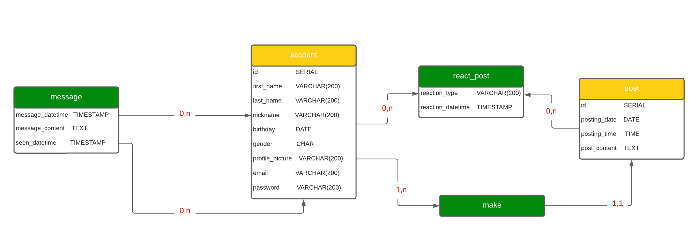

# SOCIAL MEDIA WITH SPRING
This repository contains my final exam project about social media.
## PROJECT HIGHLIGHTS
- **API REST Implementation**: This project showcases the utilization of Spring to build a comprehensive API that adheres to RESTFUL principles.
- **CRUD Operations**: The project focuses on the essential Create, Read, Update, and Delete (CRUD) operations
## MCD
- MCD version 1

- MCD version 2

## Implementation of the database
1. First of all, make sure you have PostgreSQL version 10 or higher installed on your OS(I used version 14)
2. Open your PostgreSQL terminal and create the database: `social_media`
3. After that, you have to connect to the created database and run the `social_media.sql`  that contains the create table script, in the resources package
4. Finally, you run the `insert.sql` also in the resources package for the mocks data 
## OpenAPI documentation
Since it's a project about API REST, you can view the documentation by the next link:
[OpenApi Documentation](https://petstore.swagger.io/?url=https://raw.githubusercontent.com/Harenabs21/social-media-with-spring/main/social_media_docs.yml#/)
> PS: I'm really sorry about the sound quality of the video, I just didn't have any good earphones.